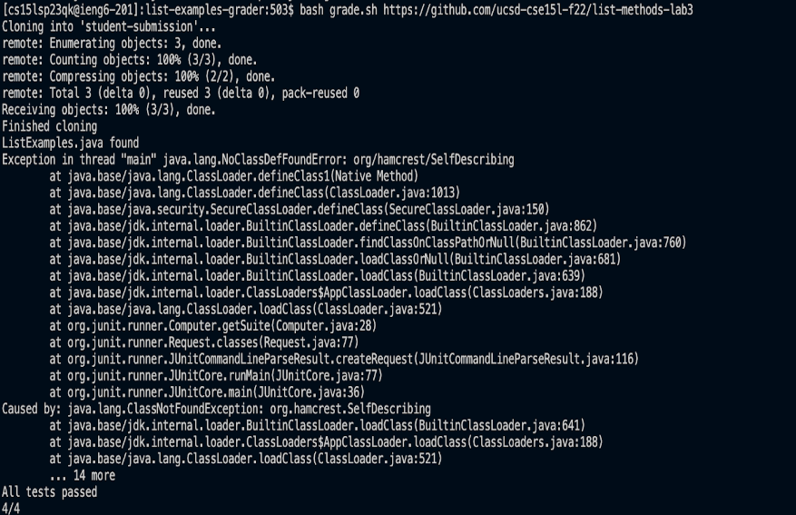
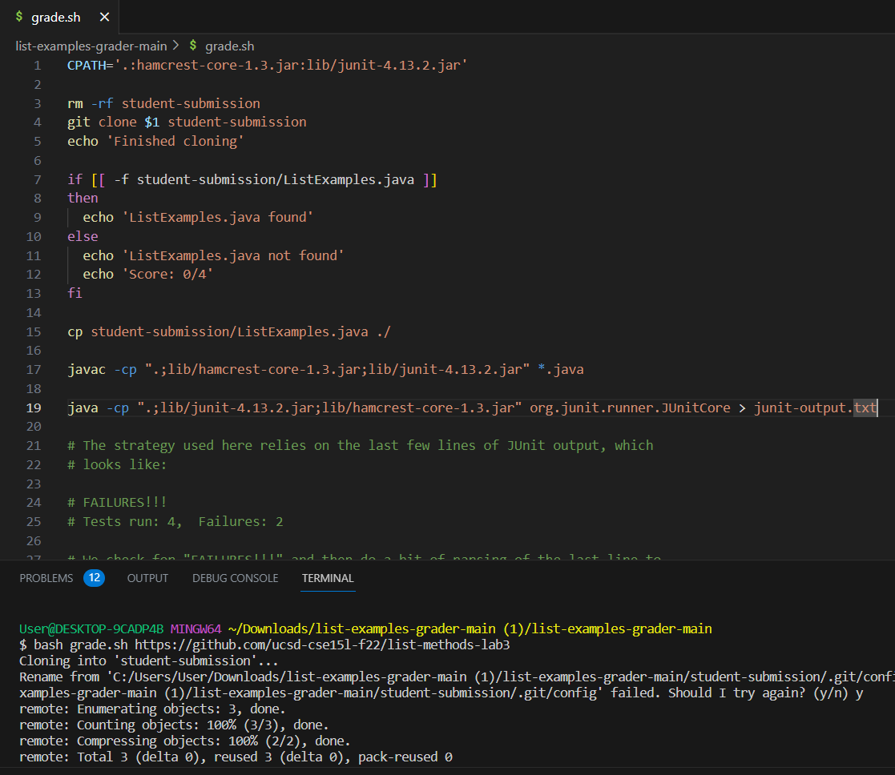
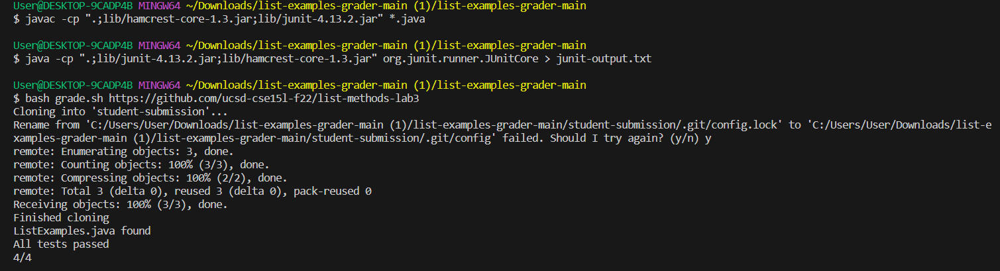

## Student Question:
**What environment are you using (computer, operating system, web browser, terminal/editor, and so on)?**\
I am working on a windows computer, using visual studio code, running the commands on the terminal, and the folder contains the files; grade.sh, GradeServer.java, ListExamples.java, Server.java, TestListExamples.java.

**Detail the symptom you're seeing. Be specific; include both what you're seeing and what you expected to see instead. Screenshots are great, copy-pasted terminal output is also great. Avoid saying “it doesn't work”.**
\
The grade.sh file runs and produces an output, but the output produced is incorrect. The desired output would have been the autograder grading the git url without having any errors occur within the run, that however does not happen since there appears to be an error occur with the junit. 

**Detail the failure-inducing input and context. That might mean any or all of the command you're running, a test case, command-line arguments, working directory, even the last few commands you ran. Do your best to provide as much context as you can.**\
I first used the `git clone` command to clone the repository. Then I used `cd list-examples-grader-main/` to change working directories. Finally I used the command `$ bash grade.sh https://github.com/ucsd-cse15l-f22/list-methods-lab3` to run the autograder on the git url. 

## TA Response:
The error occurs, because there seems to be no path to the hamcrest-core junit file. To fix this error you have to add `/lib` instead of `CPATH` in grade.sh. To do this some edits will need to be made to `grade.sh`, refer back to the commands in week 3 to help make the proper changes.  

## Student Trying Solution:
**Fixed Bash Script:**

**Terminal:**

## Process: 
The only file that was changed was grade.sh everything else remained the same. First I went into `grade.sh` file and edited both lines **17** and **19**. On line 17 I removed the CPATH and in its place copy and pasted the following `".;lib/hamcrest-core-1.3.jar;lib/junit-4.13.2.jar" *.java`. Then on line 19 I replaced the CPATH once more with the following `".;lib/junit-4.13.2.jar;lib/hamcrest-core-1.3.jar" org.junit.runner.JUnitCore > junit-output.txt`. Line 17 changed to `javac -cp ".;lib/hamcrest-core-1.3.jar;lib/junit-4.13.2.jar" *.java` and line 19 changed to `java -cp ".;lib/junit-4.13.2.jar;lib/hamcrest-core-1.3.jar" org.junit.runner.JUnitCore > junit-output.txt`. I then ran both line 17 and 19 in the terminal, followed by `bash grade.sh https://github.com/ucsd-cse15l-f22/list-methods-lab3` and the program worked. 

**Before:** 

